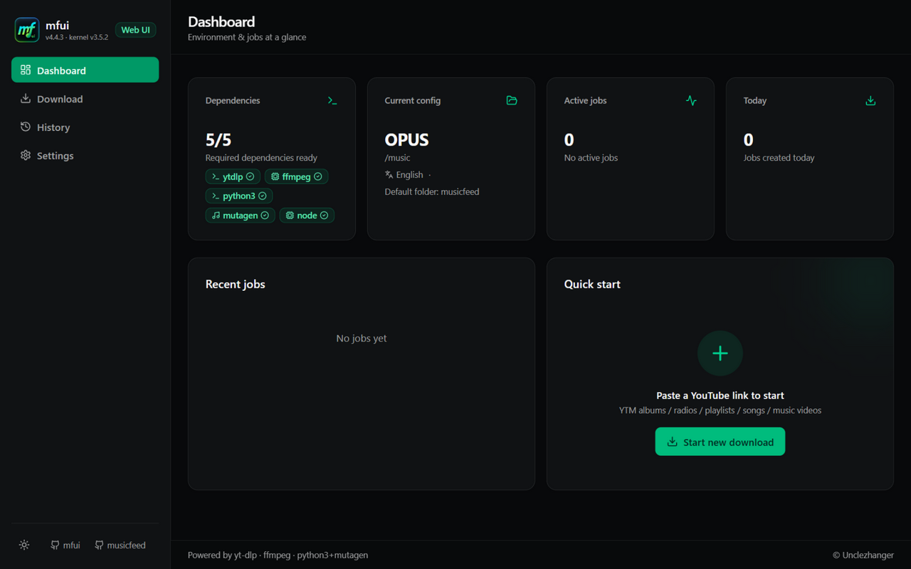
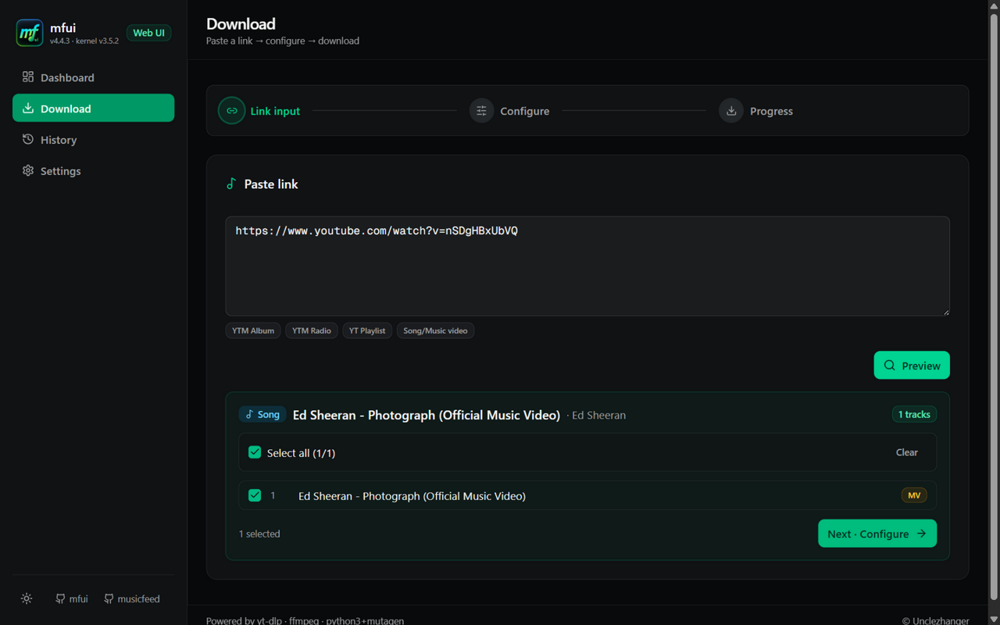
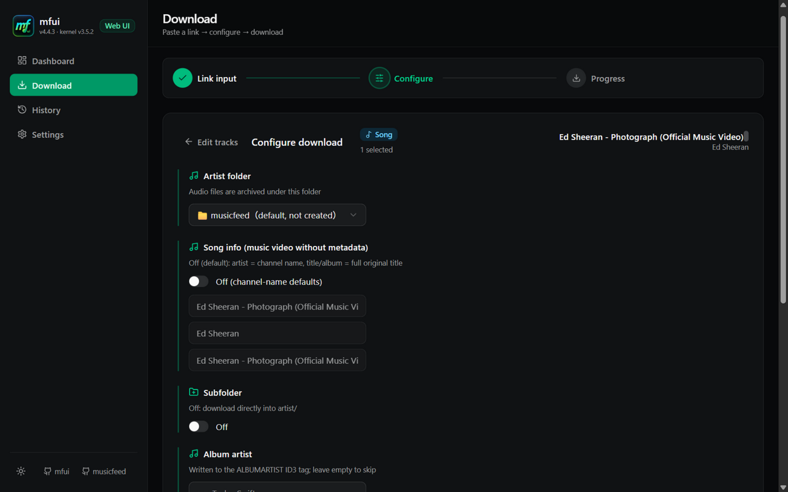
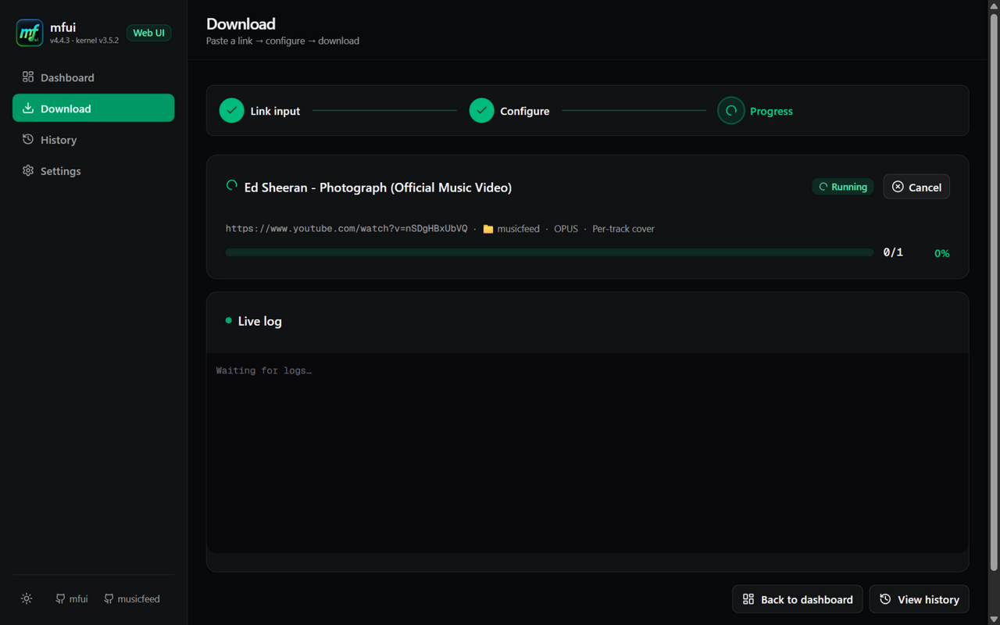
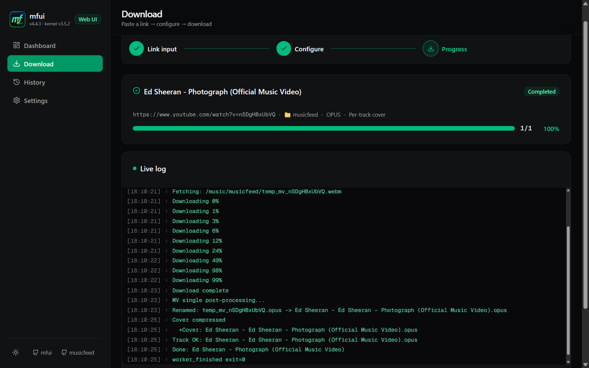
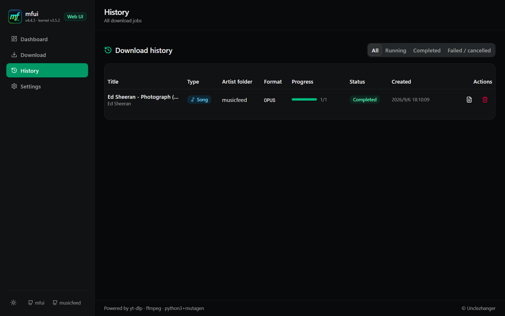
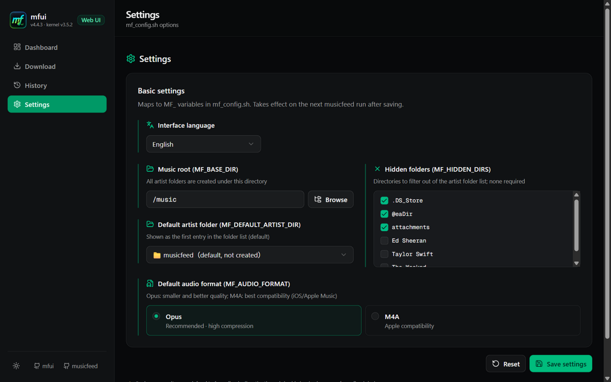
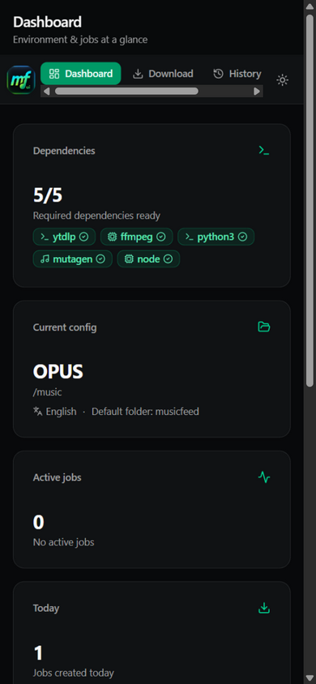
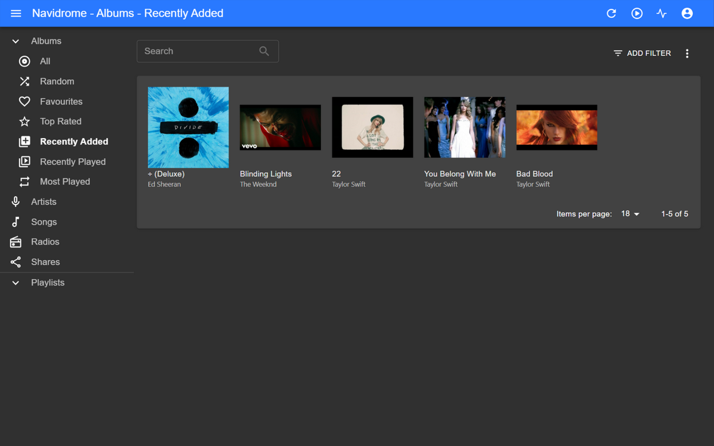

<p align="center">
  
</p>

<h1 align="center">mfui</h1>

<p align="center">
  <strong>Web UI + Docker for the musicfeed download kernel — YouTube Music to your self-hosted library, with correct covers & tags.</strong>
</p>

<p align="center">
  <a href="#-quick-start">Install</a> ·
  <a href="#-using-mfui">Using mfui</a> ·
  <a href="#-how-it-works">How it works</a> ·
  <a href="#-faq">FAQ</a> ·
  <a href="https://github.com/Unclezhanger/musicfeed">CLI edition</a>
</p>

<p align="center">
  <a href="https://github.com/Unclezhanger/mfui/releases"></a>
  <a href="LICENSE"></a>
  <a href="https://github.com/Unclezhanger/musicfeed"></a>
  
</p>

---

## 🤔 What is mfui?

mfui is a self-hosted web interface for downloading music from YouTube and
YouTube Music into the exact shape a music server expects. If you run
**Navidrome**, **Jellyfin**, **Plex** or any Subsonic-compatible server,
mfui takes care of the three things that normally make downloaded music
look broken in your library:

| Problem | What mfui does |
| --- | --- |
| Album covers padded to 16:9, wrong or missing art | Three cover strategies chosen per track — 1:1 center-crop for tagged YTM audio, unified album art for albums, original-aspect thumbnails for music videos |
| Missing / wrong ID3 tags, artists split across entries | Writes full tags including `album_artist`, splits multi-artist strings (`feat.` / `&`), fills album from real metadata when available |
| Filenames like `【MV】【動態歌詞】Song Name (Official Audio)` | A title-extraction engine rebuilds clean `artist - title` names from the polluted title + channel |

It is built on the
[musicfeed](https://github.com/Unclezhanger/musicfeed) bash kernel — the CLI
edition shares the same engine and the same `mf_config.sh`.

## 📸 Screenshots

**Dashboard** — dependencies, current config and recent jobs at a glance:



**Paste a link → preview the track list → pick your tracks** (metadata and
MV badges tell you upfront how each track will be treated):



**Configure** — artist folder, subfolder on/off, album artist, cover mode
(unified / per-track), Opus or M4A:



**Live progress** — real-time log and a progress bar that reaches 100%:



Completed, with the file renamed, tagged and the cover embedded:



**History** keeps every job (filter running / completed / failed), each with
a full log you can re-open:



**Settings** — music root with a folder-tree browser, default artist folder,
hidden-folder checklist, interface language (8 languages):



Installable as a **PWA** on your phone (share YouTube links straight into
the queue):

<p align="center">
  
</p>

The end result in **Navidrome** — one album (unified cover) plus four MV
singles (per-track covers), everything tagged:



## 🚀 Quick Start

### Docker (recommended)

You need [Docker](https://docs.docker.com/engine/install/) with the
compose plugin. That's it — no Node.js, no Python, no yt-dlp to install.

```bash
mkdir mfui && cd mfui
curl -O https://raw.githubusercontent.com/Unclezhanger/mfui/main/docker-compose.yml
```

Edit `docker-compose.yml` and point the music volume at your library:

```yaml
volumes:
  - /home/youruser/navidrome/music:/music   # <-- your music directory
```

Then start:

```bash
docker compose up -d
```

Open **http://localhost:3011** — on first start the container automatically
creates the database, seeds a default config and installs yt-dlp + mutagen
into a persistent venv (auto-updated on every start; disable with
`MF_YTDLP_AUTOUPDATE=0`).

Notes:

- The web UI listens on **host port 3011** (container-internal 3010) so it
  can coexist with a bare-metal mfui installed via `start.sh` on 3010.
- The download services run as `MFUI_UID`/`MFUI_GID` (default `1000:1000`).
  Downloaded files in your music library are owned by that user — set the
  two variables in `docker-compose.yml` if your user has a different UID.
- All state (database, logs, config, venv) lives in named volumes
  (`mfui-db`, `mfui-log`, `mfui-config`, `mfui-venv`) and survives
  container upgrades.

<details>
<summary>Prefer <code>docker run</code>?</summary>

```bash
docker run -d --name mfui --restart unless-stopped \
  -p 3011:3010 \
  -e MF_YTDLP_AUTOUPDATE=1 -e TZ=Asia/Shanghai \
  -e MFUI_UID=1000 -e MFUI_GID=1000 \
  -v /home/youruser/navidrome/music:/music \
  -v mfui-db:/app/db -v mfui-log:/app/musicfeed/log \
  -v mfui-config:/config -v mfui-venv:/app/.venv \
  ghcr.io/unclezhanger/mfui:latest
```

</details>

<details>
<summary>Prefer to build locally?</summary>

```bash
git clone https://github.com/Unclezhanger/mfui.git
cd mfui
docker compose up -d --build
```

</details>

### Bare metal (no Docker)

Requires **Node.js ≥ 20**, `ffmpeg`, `python3` (+ `venv`) and bash 4+
(macOS: `brew install bash` first):

```bash
git clone https://github.com/Unclezhanger/mfui.git
cd mfui
bash setup.sh         # dependency check + one-click install, database, .env
bash start.sh --prod  # production mode on http://localhost:3010
```

- `--prod` builds the standalone bundle once, then starts instantly. Use it
  for daily driving — plain `bash start.sh` is the developer mode
  (localhost only).
- Downloads are written by your own user, so your library stays manageable
  with normal file tools.
- To stop: `bash stop.sh`. To update: `git pull`, then repeat
  `start.sh --prod` — it detects the stale build and offers to rebuild.

## 📖 Using mfui

1. **Open the dashboard.** The dependency card should read `5/5` — if
   something is missing, the page tells you the exact command to install it.
2. **Paste one or more links** (up to 10, one per line) into the download
   page. Markdown links and trailing punctuation are tolerated. Supported:
   YTM albums (share **or** address-bar links), YTM radios, YouTube
   playlists, singles and music videos.
3. **Preview & pick tracks.** Each track shows a badge: 🟢 *Metadata* means
   real YTM metadata will be used; 🟡 *MV* means the video has no music
   metadata and you'll get manual input fields (pre-filled from the title).
4. **Configure.** Choose the artist folder (or create a new one), whether to
   keep an album subfolder, the cover mode, and the audio format.
5. **Download.** Watch the live log; every job is kept in **History** with
   its complete log, and the track list shows a per-track
   metadata/MV badge so you always know how a file will be named.
6. **Let your server scan.** Navidrome picks the new files up automatically
   — covers, `album_artist` and clean filenames included.

### Multi-link queue

Paste several links at once: mfui walks you through each one (select tracks
→ configure) and then downloads them **sequentially** with one merged live
log and an aggregated progress bar ("queue 2/5").

### PWA (phone)

Visit the Web UI from your phone browser and use *Add to Home Screen*.
mfui installs as an app and registers a **share target** — in the YouTube
app, tap *Share → mfui* and the link lands in the download page.

## 🧭 How it works

```
Browser ──▶ Next.js (:3011 host → :3010 container)
              ├── pages & REST API
              ├── /api/proxy/*  ──▶  job-runner (127.0.0.1:3001, not exposed)
              │                      └── spawns musicfeed kernel (bash)
              │                            └── yt-dlp + ffmpeg (project venv)
              └── /socket.io/*  ──▶ live progress & logs
```

One container, two processes, supervised by `tini`. All download work
happens in the bash kernel — the web layer only configures and observes it.

Want the terminal version of the same engine? The
[musicfeed CLI edition](https://github.com/Unclezhanger/musicfeed) runs the
identical kernel with an interactive TUI — no Node.js required.

## ⚙️ Configuration

Everything on the **Settings** page maps to `mf_config.sh` (the kernel's
config file):

| Setting | Variable | Meaning |
| --- | --- | --- |
| Music root | `MF_BASE_DIR` | Every artist folder is created here |
| Default artist folder | `MF_DEFAULT_ARTIST_DIR` | Pre-selected folder in the download form |
| Audio format | `MF_AUDIO_FORMAT` | `opus` (smaller, recommended) or `m4a` (iOS/Apple) |
| Hidden folders | `MF_HIDDEN_DIRS` | Folders hidden from the artist-folder list |
The **interface language** (8 languages) is stored in your browser.

## ❓ FAQ

**Why does the container listen on 3011 and the bare-metal install on 3010?**
So both can coexist on the same machine. If you only use one of them, any
free port works — the container publishes `3011:3010`; the bare-metal
default is `3010` (`MF_PORT_NEXT` to change).

**Why are downloads owned by a different user / root?**
The container's download services run as `MFUI_UID`/`MFUI_GID` (default
`1000:1000`) — files are owned by that user. If your library user has a
different UID, set the two variables in `docker-compose.yml`. Bare-metal
downloads are owned by the user running `start.sh`.

**Downloads fail with 403 / "Sign in to confirm…"**
YouTube throttles anonymous downloads from datacenter IPs sometimes. mfui
updates yt-dlp on every container start for a reason — make sure
`MF_YTDLP_AUTOUPDATE` is not `0`, and re-run after a failure. For
bare-metal users: `.venv/bin/pip install -U yt-dlp` from the project
directory (or re-run `bash setup.sh` — it detects an existing nightly
and refreshes it to the latest).

**Optional: run the yt-dlp nightly build.** Nightly releases track YouTube
changes more closely and can fix breakage days before the stable release.
To switch (and to update it later, re-run the same command):

```bash
# Docker container
docker exec -it mfui /app/.venv/bin/pip install --no-cache-dir --upgrade \
  "yt-dlp @ https://github.com/yt-dlp/yt-dlp-nightly-builds/releases/latest/download/yt-dlp.tar.gz"

# Bare metal (inside the project venv)
.venv/bin/pip install --no-cache-dir --upgrade \
  "yt-dlp @ https://github.com/yt-dlp/yt-dlp-nightly-builds/releases/latest/download/yt-dlp.tar.gz"
```

Note: the automatic startup update installs the **stable** release and will
not undo your nightly — after switching, re-run the command above to refresh
the nightly (or flip `MF_YTDLP_AUTOUPDATE=0` in docker-compose.yml).

**The UI says a dependency is missing**
Open the Dashboard — it lists exactly what's missing and the command to
install it. In Docker everything is bundled, so a missing dependency there
usually means the venv volume was wiped; just restart the container.

**Where do my files go?**
Into `<music root>/<artist folder>/[subfolder]/`, e.g.
`/music/Ed Sheeran/Ed Sheeran - Shape of You.opus`. The artist folder and
subfolder are chosen on the config page; with the subfolder **off**, files
go straight into the artist folder.

**How do I update?**

```bash
# Docker
cd mfui && docker compose pull && docker compose up -d

# Bare metal
cd mfui && git pull && bash start.sh --prod   # offers to rebuild
```

All data (database, logs, config, venv) survives updates.

**Does bare metal work on macOS?**
Yes. `start.sh`/`stop.sh` detect that macOS has no `setsid` and emulate it
automatically (via perl), so process management behaves exactly as on Linux.
Two macOS specifics:

- **macOS 11 (Big Sur) or older:** the `esbuild` binary bundled with `tsx`
  4.x is built for macOS 12+ and fails with a dyld error. `setup.sh` detects
  this and installs the job-runner dependencies with `tsx@3.14.0` pinned.
- **Finding your LAN IP:** use `ipconfig getifaddr en0` (Linux's
  `hostname -I` doesn't exist on macOS).

## 🌍 Languages

English (default), 中文, Deutsch, Español, Français, 日本語,
Português (Brasil), Русский — switch in **Settings → Interface language**.

## ⚠️ Disclaimer

For personal and educational use only. Please respect copyright laws in
your region. The author assumes no liability for any misuse.

## 📄 License

MIT License © 2026 [Unclezhanger](https://github.com/Unclezhanger)
